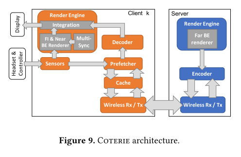

This paper studies multiplayer **Virtual Reality(VR)** on mobile divice in ASPLOS 2020.

## Background
*QoE* requirements for VR systems:
1) Low input-to-display latency
2) High-quality visual effects
3) Mobility

For single-player VR on mobile device, it can either render on mobile - **Local Rendering**, or render on server - **Remote rendering**. But the mobile devices are contrained by CPU/GPU capabilities, and rendering on servers will have network bottleneck.

## Previous Work and Motivation

Previous research has studied the single-player case for VR, like *Furion*. It devides the VR content into *foreground interations(FE)* and *background interations(BE)*. FE is hard to predict but cheap enough to render on mobile devices. BE is expensive to render but predicable, which can be pre-rendered on server, and be prefetched during the game.

But supporting multiplayer VR poses a new opportunity. Replicating the existing *Furion* with syncronization for multiplayer would have increased load and wireless network bottleneck. This work tries to cut off the frame transfer frequency by exploiting the similarity of BE frames in nearby locations and nearby players. 

## Exploiting Frame Similarity

This paper finds two kinds of BE similarity - *intra-player frame similarity*, which exploits similarity of adjacent locations and *inter-player frame similarity*, which exploits similarity by mutiplayers in nearby locations. The paper use *Structual Similarity (SSIM)* as the metric to quantify the similarity of two frames.

However, simply apply the BE similarity of adjacents locations is not enough due to "near-object" effect where a small displacement of near objects will change a lot more than that of faraway objects. Experiements show that the percent of BE frames that exhibit an SSIM value larger than 0.9(which means very similar) ranges from 0% to 20%. The paper then proposes a technique by seperating the BE to *near BE* and *far BE*. *far BE* still render on server since it remains computationally prohibitive on mobile. But now *near BE* renders on *FI*.

The cutoff radius that seperates near BE and far BE is determined dynamically, depending on app, device and locations. The paper propose an *adaptive cutoff scheme* by observing that within a small region the object density is uniform. The details can be referred in the paper. Such partition improve the percent of SSIM over 0.9 to around 55%.

## COTERIE Design

In offline processing, Coterie server runs the adaptive cutoff scheme to divide the *near BE* and *far BE* and pre-render and pre-encodes. During the game, the server replies the prefech request from clients.

Coterie client will render the frame for next grid during the game by performing four tasks: (1) FI and near BE rendering (2) Decode far BE frames received from server (3) Syncronizing FI between all players (4) Merging far BE, FI and near BE frames.

The frame cache at each Coterie client caches far BE frames prefetched by the cloent. The cache lookup scheme can reuse some frames for nearby locations.

## Conclusion
Coterie has better image quality, larger FPS, and less reposinsiveness over *thin-client* or *multi-furion* implementations. It;s scalable for four player. And now the network and CPU/GPU are no longer the bottleneck.